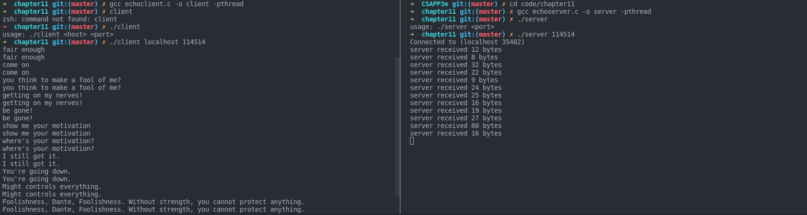
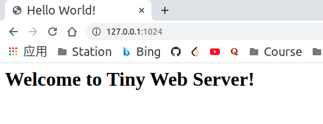
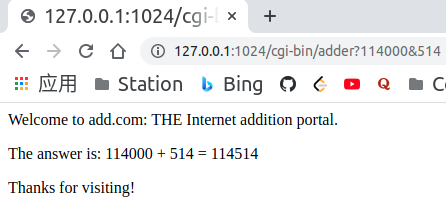
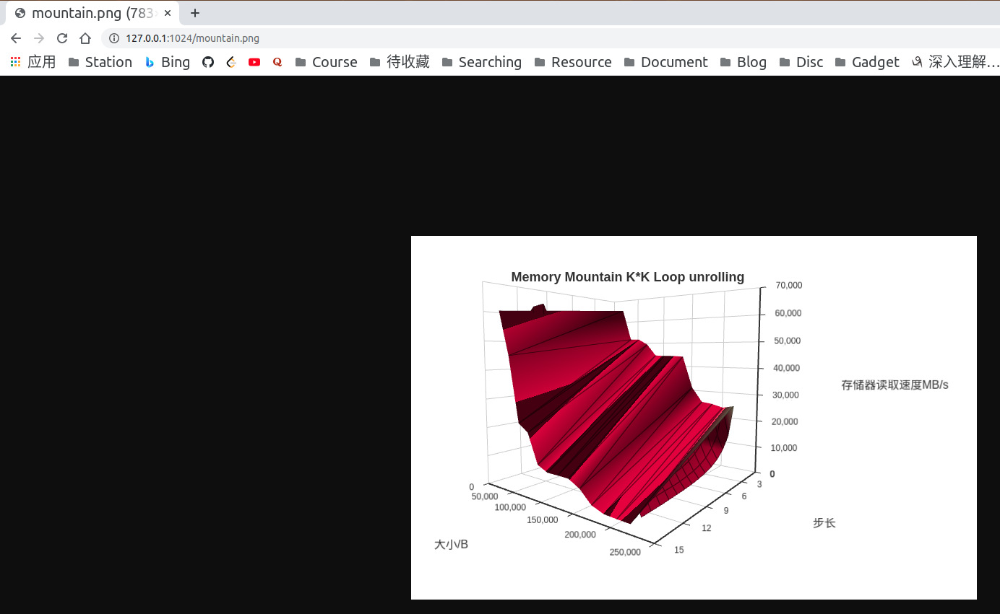

## Chapter 11 Network Programming  

### 11.2 [hex2dd.c](./hex2dd.c)  
> ✗ ./a.out 0xFFFFFFFF  
> 255.255.255.255
### 11.3 [dd2hex.c](./dd2hex.c)  
> ✗ ./a.out 255.255.255.255  
> 0xffffffff

### 11.4 [hostinfo.c](./hostinfo.c)
> ✗ ./a.out localhost
> 127.0.0.1

### [echoclient.c](./echoclient.c)
### [echoserver.c](./echoserver.c)


## 11.6 Putting it together: Tiny Web Server   


[tiny.c](./tiny.c)  
[cgi-bin/adder.c](./cgi-bin/adder.c)  

Usage:  
`cd cgi-bin`  
`gcc -o adder adder.c -pthread`  
`cd ..`  
`gcc -o tiny tiny.c -pthread`  
`./tiny 1024`  

Use `nslookup localhost` to see your own domain:

```
➜  chapter11 git:(master) ✗ nslookup localhost
.................
Non-authoritative answer:
Name:   localhost
Address: 127.0.0.1
Name:   localhost
Address: ::1
```

Browser:  
  
Server:
```shell
➜  chapter11 git:(master) ✗ ./a.out 1024
Accepted connection from (localhost 56772)
Request headers:
GET / HTTP/1.1
Connection: keep-alive
sec-ch-ua: " Not A;Brand";v="99", "Chromium";v="90", "Google Chrome";v="90"
sec-ch-ua-mobile: ?0
Upgrade-Insecure-Requests: 1
User-Agent: Mozilla/5.0 (X11; Linux x86_64) AppleWebKit/537.36 (KHTML, like Gecko) Chrome/90.0.4430.212 Safari/537.36
Accept: text/html,application/xhtml+xml,application/xml;q=0.9,image/avif,image/webp,image/apng,*/*;q=0.8,application/signed-exchange;v=b3;q=0.9
Sec-Fetch-Site: none
Sec-Fetch-Mode: navigate
Sec-Fetch-User: ?1
Sec-Fetch-Dest: document
Accept-Encoding: gzip, deflate, br
Accept-Language: zh-CN,zh;q=0.9,en-US;q=0.8,en;q=0.7

Response headers:
HTTP/1.0 200 OK
Server: Tiny Web Server
Connection: close
Content-length: 133
Content-type: text/html

Accepted connection from (localhost 56774)
Request headers:
GET /favicon.ico HTTP/1.1
Connection: keep-alive
sec-ch-ua: " Not A;Brand";v="99", "Chromium";v="90", "Google Chrome";v="90"
sec-ch-ua-mobile: ?0
User-Agent: Mozilla/5.0 (X11; Linux x86_64) AppleWebKit/537.36 (KHTML, like Gecko) Chrome/90.0.4430.212 Safari/537.36
Accept: image/avif,image/webp,image/apng,image/svg+xml,image/*,*/*;q=0.8
Sec-Fetch-Site: same-origin
Sec-Fetch-Mode: no-cors
Sec-Fetch-Dest: image
Referer: http://127.0.0.1:1024/
Accept-Encoding: gzip, deflate, br
Accept-Language: zh-CN,zh;q=0.9,en-US;q=0.8,en;q=0.7

Accepted connection from (localhost 56900)
Request headers:
GET / HTTP/1.1
Connection: keep-alive
Cache-Control: max-age=0
sec-ch-ua: " Not A;Brand";v="99", "Chromium";v="90", "Google Chrome";v="90"
sec-ch-ua-mobile: ?0
Upgrade-Insecure-Requests: 1
User-Agent: Mozilla/5.0 (X11; Linux x86_64) AppleWebKit/537.36 (KHTML, like Gecko) Chrome/90.0.4430.212 Safari/537.36
Accept: text/html,application/xhtml+xml,application/xml;q=0.9,image/avif,image/webp,image/apng,*/*;q=0.8,application/signed-exchange;v=b3;q=0.9
Sec-Fetch-Site: none
Sec-Fetch-Mode: navigate
Sec-Fetch-User: ?1
Sec-Fetch-Dest: document
Accept-Encoding: gzip, deflate, br
Accept-Language: zh-CN,zh;q=0.9,en-US;q=0.8,en;q=0.7

Response headers:
HTTP/1.0 200 OK
Server: Tiny Web Server
Connection: close
Content-length: 131
Content-type: text/html

Accepted connection from (localhost 56902)
```

Serve dynamic content:  


Serve static content(picture):  
  