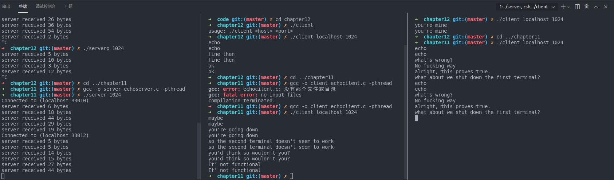
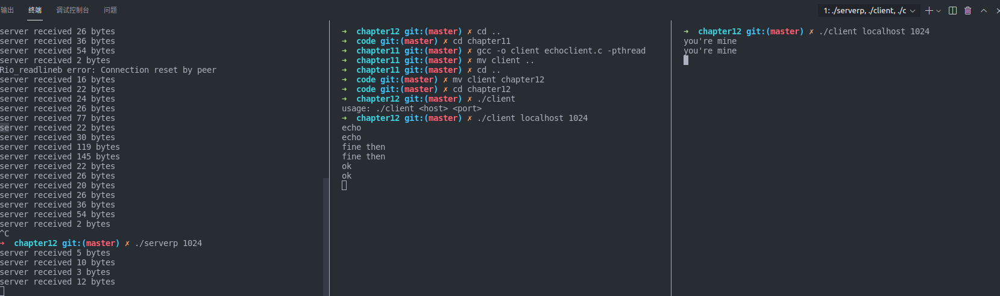
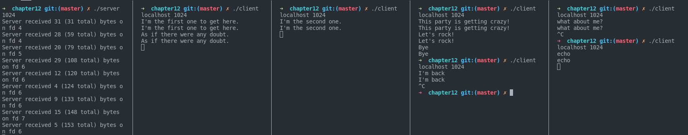
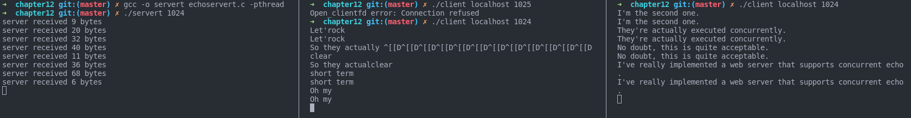

## Chapter 12 Concurrent Programming  

Usage:  
`gcc -o server echoserver(p|s|t).c -pthread`  
`./server 1024`  
`./client localhost 1024`  

### 0. Doesn't support concurrency  

[see the version of chapter11:](../chapter11/echoserver.c)  

### 1. With processes  

[echoserverp.c](./echoserverp.c)  
  

### 2. With I/O multiplexing  

[echoservers.c](./echoservers.c)  
  

### 3. With threads  

[echoservert.c](./echoservert.c)  
  

