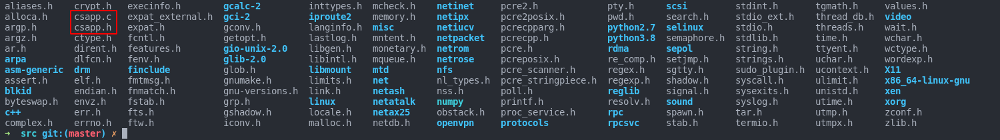

# source code in book  

Other interesting code examples can be found at the offcial website: [csapp 3e](http://csapp.cs.cmu.edu/3e/code.html)  

Here I will introduce how to use some code examples. 


## csapp.c && csapp.h  

How to use:  

1. Add `#include "csapp.c"`at the last line before `#endif` at in csapp.h, like this: 

```c
int Open_clientfd(char *hostname, char *port);
int Open_listenfd(char *port);

#include "csapp.c"//this is the newly added code.  
#endif /* __CSAPP_H__ */
/* $end csapp.h */
```  
2. `sudo cp csapp.h /usr/include`  
   `sudo cp csapp.c /usr/include`  

3. check:  
`ls /usr/include`  

There it is!  

4. Then you can add `#include<csapp.h>` at the top line of any source code of the textbook.

5. since the csapp.h involves support to threads, you should enter extra parameter`-lpthread` to compile your code, like this:  
`gcc -o obj [source.c] -lpthread`  

otherwise, it would **panic**:  
```bash
➜  chapter8 git:(master) ✗ gcc shellex.c
/usr/bin/ld: /tmp/cc2lFujq.o: in function `Pthread_create':
shellex.c:(.text+0x1252): undefined reference to `pthread_create'
/usr/bin/ld: /tmp/cc2lFujq.o: in function `Pthread_cancel':
shellex.c:(.text+0x128b): undefined reference to `pthread_cancel'
/usr/bin/ld: /tmp/cc2lFujq.o: in function `Pthread_join':
shellex.c:(.text+0x12cf): undefined reference to `pthread_join'
/usr/bin/ld: /tmp/cc2lFujq.o: in function `Pthread_detach':
shellex.c:(.text+0x1308): undefined reference to `pthread_detach'
/usr/bin/ld: /tmp/cc2lFujq.o: in function `Pthread_once':
shellex.c:(.text+0x1377): undefined reference to `pthread_once'
/usr/bin/ld: /tmp/cc2lFujq.o: in function `Sem_init':
shellex.c:(.text+0x13a4): undefined reference to `sem_init'
/usr/bin/ld: /tmp/cc2lFujq.o: in function `P':
shellex.c:(.text+0x13d3): undefined reference to `sem_wait'
/usr/bin/ld: /tmp/cc2lFujq.o: in function `V':
shellex.c:(.text+0x1402): undefined reference to `sem_post'
collect2: error: ld returned 1 exit status
```


