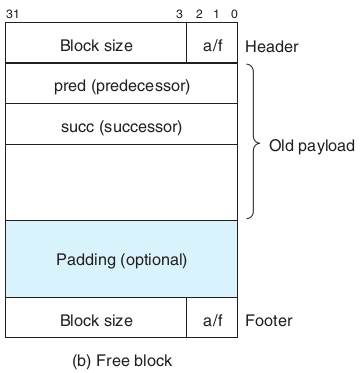

# Malloc lab 

As usual:
`tar -xf malloclab.tar`  
And copy the traces files at the current directory, modify the line 15 of `config.h` into  
`#define TRACEDIR "./traces/"`

It says that `mm.c` is the only file we should modify.  

We choose **segregated list** as our solution.  

## Marco  

First up, the textbook provided us with a lot of useful marcos:  

```c
#define WSIZE 4
#define DSIZE 8
#define CHUNKSIZE (1<<12) /* Extend heap by this amount (bytes) */
#define MINBLOCKSIZE 16

#define MAX(x, y) ((x) > (y) ? (x) : (y))
#define PACK(size, alloc) ((size) | (alloc)) /* Pack a size and allocated bit into a word */

/* Read and write a word at address p */
#define GET(p) (*(unsigned int *)(p))
#define PUT(p, val) (*(unsigned int *)(p) = (val))
/* Read the size and the alloc field field from address p */
#define GET_SIZE(p) (GET(p) & ~0x7)
#define GET_ALLOC(p) (GET(p) & 0x1)
/* Given block ptr bp, compute address of its header and footer*/
#define HDRP(bp) ((char*)(bp) - WSIZE)
#define FTRP(bp) ((char*)(bp) + GET_SIZE(HDRP(bp)) - DSIZE)
/* Given block ptr bp, compute address of next and prev blocks */
#define NEXT_BLKP(bp) ((char*)(bp) + GET_SIZE(HDRP(bp)))
#define PREV_BLKP(bp) ((char*)(bp) - GET_SIZE((char*)(bp)-DSIZE))
```

However, since our choice is segregated lists, which use the same data structure as explicit lists, namely, freeblocks with two pointers at previous block and next block:

