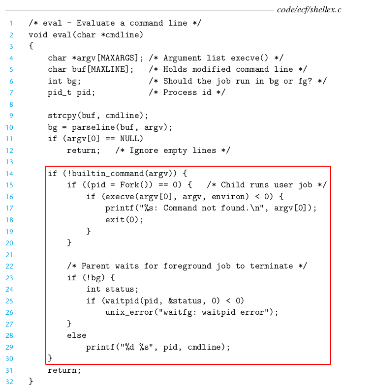
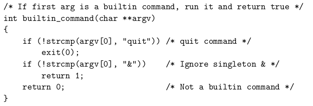
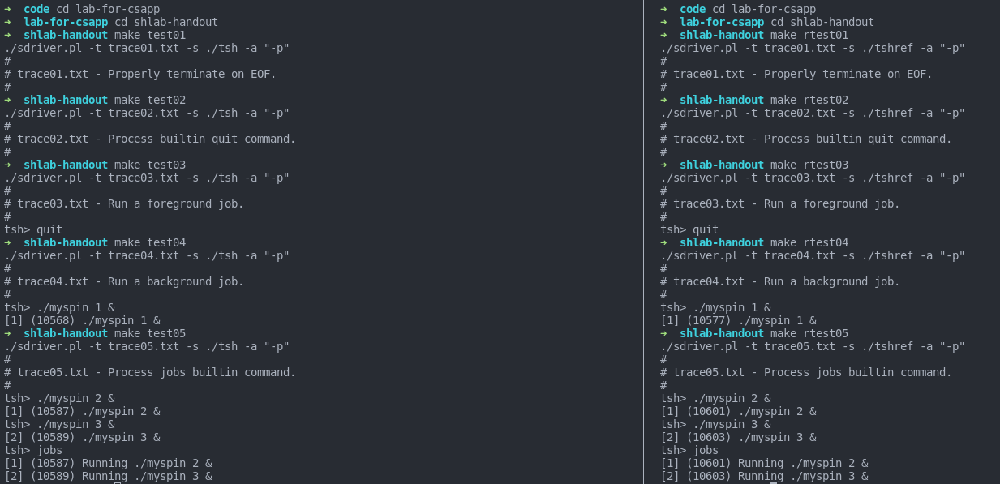
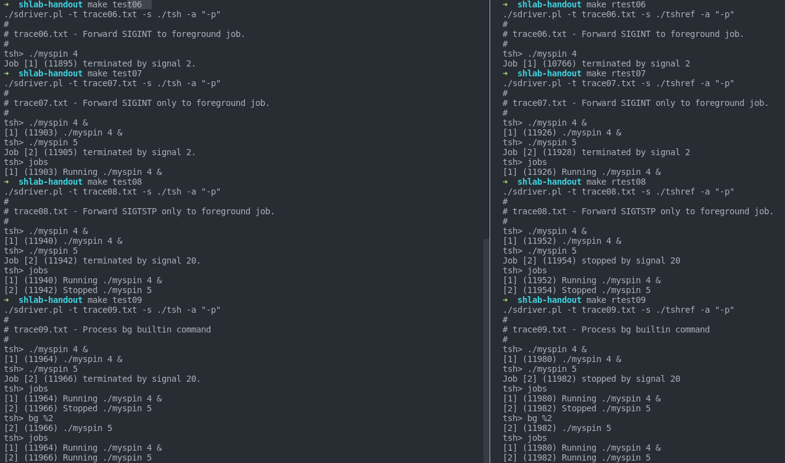
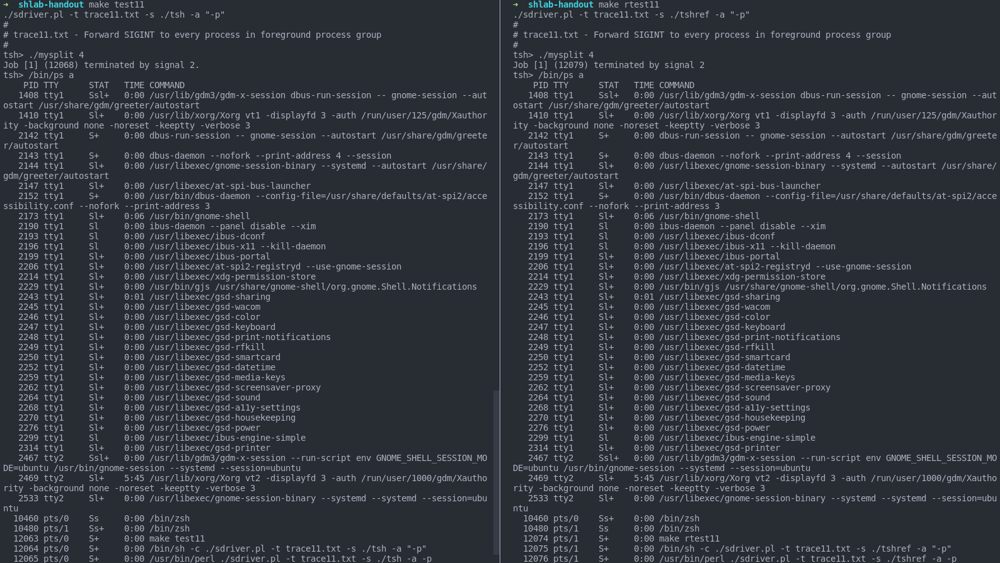
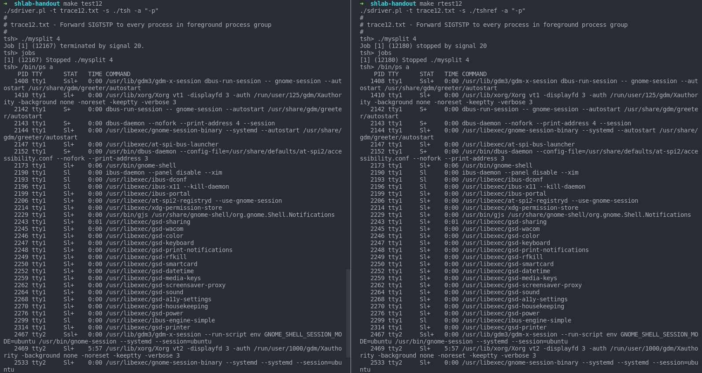
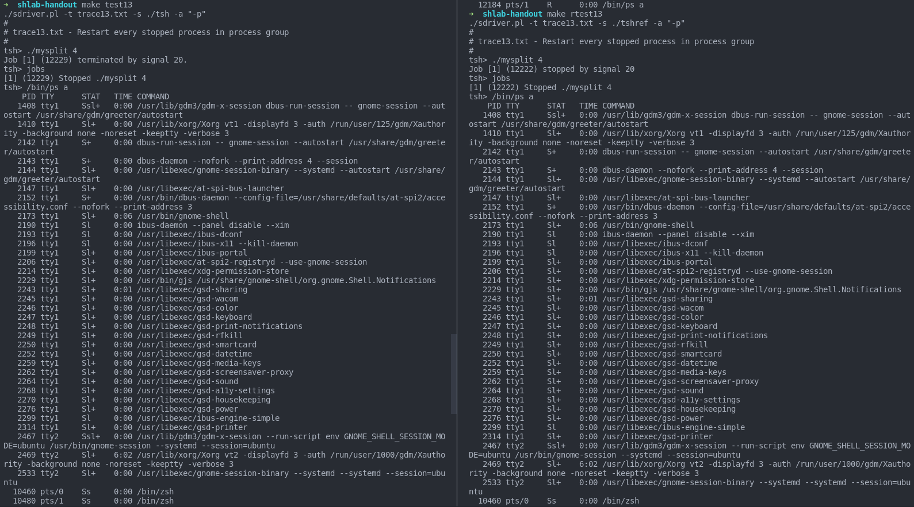
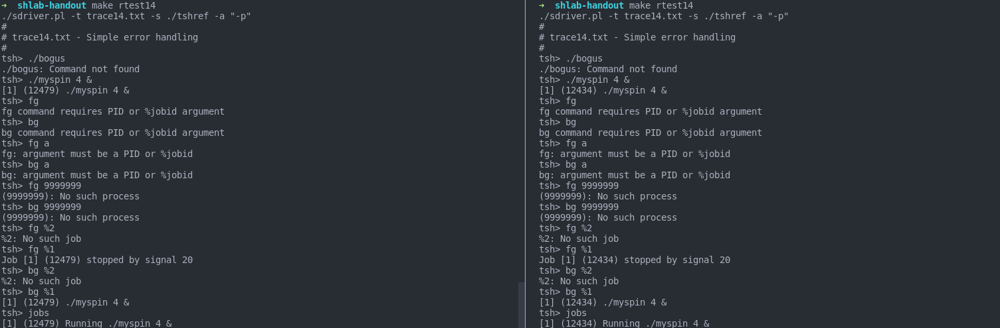
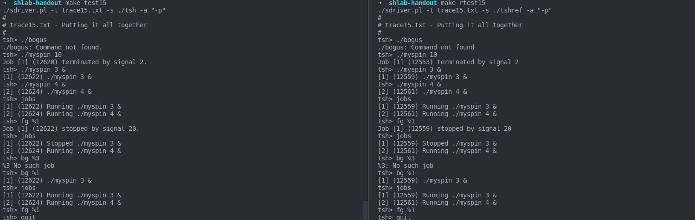
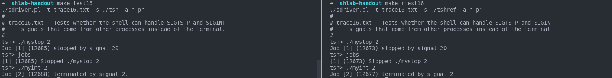

# Shell Lab  

First up, unpack the package to anywhere you want.  
`tar -xf shelllab.tar`  

`tsh.c` is where we're going to jump into.  

we're going to implement 7 functions in the directory.  
+ `void eval(char *cmdline);`
+ `int builtin_cmd(char **argv);`
+ `void waitfg(pid_t pid);`
+ `void sigchld_handler(int sig);`
+ `void sigtstp_handler(int sig);`
+ `void sigint_handler(int sig);`
+ `void do_bgfg(char **argv);`

To see if your implementation is right, whenever you modify the file, you should run `make` in the terminal.  

Then you could run `make test[00-16]` and `make rtest[00-16]` to see if their outputs are identical.  

For example:  
`make test00`  
`make rtest00`  
when you input these two commands, and your terminal will output something.  
Your duty is to ensure their respective outputs are nearly the same(except for concrete PID etc.).  

---

## eval  

In fact, the book has already provided us with a simple, flawed version of shell:  



So we simply paste most of its framework, and then we will implement some details. 

Apparently, it does not support signal, so it cannot avoid potential race and cannot reap the zombies spawned by background process. So what we should do is fix the code within the red retangular.  

```c
void eval(char *cmdline){
    ......
    sigset_t mask_one, mask_all, prev_one;
    sigfillset(&mask_all);
    ......
}
```
First, we need to define three sigset and fill the mask_all.  
`mask_one` is used to block child signal.  
`prev_one`, if you've already read chapter8, is used to store current blocked bit, which can recover to the initial status.    
`mask_all` is used to block every signal, which will be useful when we modify the global variable. In this case, it's `jobs`, conncected with `addjob` and `deletejob`. Everytime we use these two functions we have to block every signal, namely mask_all.  
```c
void eval(char *cmdline){
    ...
    if(!builtin_cmd(argv)){
        sigemptyset(&mask_one);
        sigaddset(&mask_one, SIGCHLD);

        sigprocmask(SIG_BLOCK, &mask_one, &prev_one);
        if ((pid = fork()) == 0){
            ...
        }
        ...
    }
    ...
}
```
After the if-statement and right before fork(), we need to initialize mask_one with SIGCHLD, then block it and save the current blocked bit to prev_one.  
**It is to avoid race between child process to parent process**. If the child win the race, it would signal parent to `deletejob()`, which does nothing. However, this results in `addjob()` to add a non-exist job to the array `jobs[]`, which is pointless. So we need to ensure that addjob() happens before `deletejob()`, and the solutions is, as former, to block `SIGCHLD`.  

```c
if ((pid = fork()) == 0){
    sigprocmask(SIG_SETMASK, &prev_one, NULL);
    if(setpgid(0,0)<0){
        perror("SETPGID ERROR");
        exit(0);
    }
    ...
}
```

In the fork(), we should do more. We should know that there's no need for child process to block SIGCHLD. Otherwise, it will fail to signal the parent process that it has exited already, and consequently it would become a zombie. So we should unblock SIGCHLD or simply recover with prev_one.  

And before the `eval()` you would see that lecturer said that:
> Note: each child process must have a unique process group ID so that our background children don't receive SIGINT (SIGTSTP) from the kernel when we type ctrl-c (ctrl-z) at the keyboard.  

So we should add a group ID with their own, by `setpgid()`  


```c
        int state = (bg ? BG:FG);

        sigprocmask(SIG_BLOCK, &mask_all, NULL);
        addjob(jobs, pid, state, cmdline);
        sigprocmask(SIG_SETMASK, &prev_one, NULL);
        if(!bg)
            waitfg(pid);
        else
            printf("[%d] (%d) %s", pid2jid(pid),pid, cmdline);
```

And the rest is relatively easy.  
First we need to figure whether the cmdline is background or foreground. Luckily, the lecturer has already done this for us. So we simply define a state corresponding to the value of `bg`.  

As mentioned before, whenever we modify the global variable we need to block all signals. This is implemented as former.  

Finally, if it's a foreground process, we `waitfg` for all children process.  

If it's background process, we simply printout its jid, pid and cmdline.  

At first glance, the content of `printf` may require ingeneuity. However, identifying these format needs comparing two different output on your own and then modify, so don't worry.  


Complete code:
```c
void eval(char *cmdline) 
{
    char* argv[MAXARGS];
    char buf[MAXLINE];
    int bg;
    pid_t pid;

    sigset_t mask_one, mask_all, prev_one;
    sigfillset(&mask_all);


    strcpy(buf, cmdline);
    bg = parseline(buf, argv);
    if(argv[0] == NULL)
        return;
    
    if(!builtin_cmd(argv)){

        sigemptyset(&mask_one);
        sigaddset(&mask_one, SIGCHLD);

        sigprocmask(SIG_BLOCK, &mask_one, &prev_one);
        if ((pid = fork()) == 0){

            sigprocmask(SIG_SETMASK, &prev_one, NULL);
            if(setpgid(0,0)<0){
                perror("SETPGID ERROR");
                exit(0);
            }
            
            if(execve(argv[0], argv, environ) < 0){
                printf("%s: Command not found.\n", argv[0]);
                exit(0);
            }
        }

        int state = (bg ? BG:FG);

        sigprocmask(SIG_BLOCK, &mask_all, NULL);
        addjob(jobs, pid, state, cmdline);
        sigprocmask(SIG_SETMASK, &prev_one, NULL);
        if(!bg)
            waitfg(pid);
        else
            printf("[%d] (%d) %s", pid2jid(pid),pid, cmdline);
        
    }
    return;

}
```

## builtin_cmd  

It may be inspirational if we look at the code provided by textbook:  


So, all we need to do is to use standard `strcmp` to compare each string in the if-statement and then do something.  

We need to implement fg, bg, quit and jobs.  

bg, fg, jobs has their corresponding procedure and `jobs`'s function `listjobs()` is already applicable.  

So we simply insert function and then return 1. 
Note that quit is tantamount to exit, which never returns.  

```c
int builtin_cmd(char **argv) 
{
    if(!strcmp(argv[0],"quit"))
        exit(0);
    else if(!strcmp(argv[0],"jobs")){
        listjobs(jobs);
        return 1;
    }
    else if(!strcmp(argv[0],"bg")||!strcmp(argv[0],"fg")){
        do_bgfg(argv);
        return 1;
    }
    return 0;     /* not a builtin command */
}
```

## waitfg

Why would we not first implement do_bgfg? Since it's a builtin command and occurs in the latter testfile.  

This procefure is designed to wait foreground process, so we find the job by the argument pid and wait for a signal.  

To avoid the perfomance problem and "infinite-pause"
introduced in the book, we should not use `pause();` and `;` in the while loop. Instead, we use `sigsuspend(&mask)`.  

Notice we don't have to explictly `sigaddset(&mask, SIGCHLD)` here.

```c
void waitfg(pid_t pid)
{   
    sigset_t mask;
    sigemptyset(&mask);
    while(fgpid(jobs) == pid)
        sigsuspend(&mask);
    return;
}
``` 

Up to now, `make test04` still will result in a infinite loop since we haven't implement the handle for SIGCHLD properly. 

## sigchld_handler

In handler, it's always a good habit to teamporarily save errno into a local variable and set it back at the end of the function:
```c
void handler(int){
    int olderr = errno;
    ......
    errno = olderr;
    return;
}
```
This handler is designed to let children process reaped by the parent process and to record their consequence how they exit the process:

First up, we should wait for all children:
```c
void handler(int){
    int olderr = errno;
    ......
    while((pid = waitpid(-1, &status, 0) > 0){
        ......
    }
    errno = olderr;
    return;
}
```

we want them to return back No matter they're interrupted by keyboard or by stop signal, so the third argument should be `WNOHANG|WUNTRACED`.  

Consequently, we want different consequence handled by different branch, for example, normal exit, apparently, should be handled differently against being interrupted by keyboard. Hence:  

```c
void handler(int){
    int olderr = errno;
    ......
    while((pid = waitpid(-1, &status, 0) > 0){
        if(WIFEXITED(status)){
            ...
        }else if(WIFSIGNALED(status)){
            ...
        }else if(WIFSTOPPED(status)){
            ...
        }
    }
    errno = olderr;
    return;
}
```
Two former branches need to finish the work -- deletejob(), and therefore they should be followed by blocking signal and recovery, and a print message if necessary. But the third one, which does not need to be deleted but stopped, just requires to change its running state, and of course it need blocking signal too.  

And the content of `print` need several comparison and debug to get it right.  

Note that the `printf()` statement is not async-signal-safe function. Strictly it should be replaced by `write()` alike.  

Complete code: 

```c
void sigchld_handler(int sig) 
{   
    int olderr = errno;
    
    pid_t pid;
    sigset_t mask_all, prev_one;
    sigfillset(&mask_all);
    int status;
    while((pid = waitpid(-1, &status, WNOHANG|WUNTRACED))>0){
        if(WIFEXITED(status)){
            sigprocmask(SIG_BLOCK, &mask_all, &prev_one);
            deletejob(jobs,pid);
            sigprocmask(SIG_SETMASK, &prev_one, NULL);
        }else if(WIFSIGNALED(status)){
            sigprocmask(SIG_BLOCK, &mask_all, &prev_one);
            printf("Job [%d] (%d) terminated by signal %d.\n", pid2jid(pid), pid, SIGINT);
            deletejob(jobs,pid);
            sigprocmask(SIG_SETMASK, &prev_one, NULL);
        }else if(WIFSTOPPED(status)){
            struct job_t* job = getjobpid(jobs, pid);
            sigprocmask(SIG_BLOCK, &mask_all, &prev_one);
            printf("Job [%d] (%d) stopped by signal %d.\n", pid2jid(pid), pid, SIGTSTP);
            job->state = ST;
            sigprocmask(SIG_SETMASK, &prev_one, NULL);
        }
    }
    errno = olderr;
    return;
}
```

and now `make test04` works as expected.  

## sigint_handler  

Framework is easy:  
```c
void sigint_handler(int sig) 
{
    int olderr = errno;
    ...
    errno = olderr;
    return;
}
```

All we need to do is find the foreground process, and give that process and whose process group `SIGINT`, which is triggered by Ctrl+C.  

So we can use the `kill()` function and pass it a negative value of that PID to complete this task.  

```c
void sigint_handler(int sig) 
{
    int olderr = errno;
    pid_t pid = fgpid(jobs);
    if(pid){
        kill(-pid, SIGINT);
    }
    errno = olderr;
    return;
}
```

## sigtstp_handler  

Much the same way. 

```c
void sigtstp_handler(int sig) 
{
    int olderr = errno;
    pid_t pid = fgpid(jobs);
    if(pid){
        struct job_t* job = getjobpid(jobs,pid);
        if(job->state == ST)
            return;
        else
            kill(-pid, SIGTSTP);
    }
    errno = olderr;
    return;
}
```

In practice, I notice that in Linux Ctrl-Z is to make the process become a background process while it's still running. But the default behavior is to stop a specified process. 

## do_fgbg

This needs several comparision with `tshref`.

Notice that job id is decoded by `"%num"`, PID `"num"`. 

```c
void do_bgfg(char **argv) 
{
    if(argv[1] == NULL){
        printf("%s command requires PID or %%jobid argument.\n", argv[0]);
        return;
    }

    int id;
    struct job_t* job;

    if(sscanf(argv[1],"%%%d",&id) > 0){
        job = getjobjid(jobs, id);
        if(job == NULL){
            printf("%%%d No such job\n", id);
            return;
        }
    }else if(sscanf(argv[1],"%d", &id) > 0){
        job = getjobpid(jobs, id);
        if(job == NULL){
            printf("(%d): No such process\n", id);
            return;
        }
    }else{
        printf("%s: argument must be a PID or %%jobid.\n", argv[0]);
        return;
    }

    kill(-(job->pid),SIGCONT);
    if(!strcmp("bg", argv[0])){
        printf("[%d] (%d) %s", job->jid, job->pid, job->cmdline);
        job->state = BG;
    }else{
        job->state = FG;
        waitfg(job->pid);
    }
    return;
}
```

Here is the comparison figures:











Reference: 
+ https://nc-77.top/2020/10/23/ShellLAB/index.html